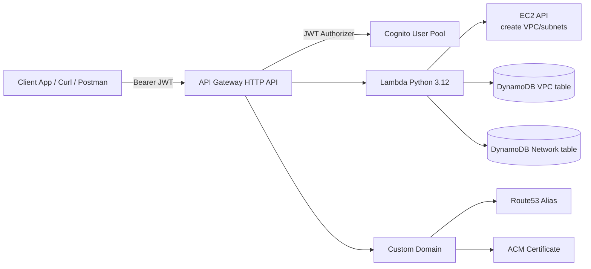

# Infra API

Serverless Python REST API on AWS for VPC and network management, deployed with Terraform modules.

This project provides:
- AWS Lambda (Python 3.12) as the API backend
- API Gateway HTTP API v2 with JWT auth on every route
- Amazon Cognito User Pool for authentication
- DynamoDB persistence
- Custom domain via ACM + Route53

## Solution Overview

The API exposes 4 endpoints:
- `POST /vpc`
- `GET /vpc`
- `POST /network`
- `GET /network`

All routes require a valid JWT token issued by Cognito.

## Architecture



## Repository Structure

```text
infra-api/
  api/
    lambda_handler.py
    handlers/
      vpc_handler.py
      network_handler.py
    services/
      aws_service.py
      dynamodb_service.py
    requirements.txt

  terraform/
    python_api/
      main.tf
      variables.tf
      outputs.tf
      provider.tf
      terraform.tf
      terraform.tfvars.example
      data.tf
    modules/
      apigateway/
      cognito/
      dynamodb/
      iam/
      lambda/
      network/
```

## How Authentication Works

1. A user authenticates against Cognito User Pool.
2. Cognito returns tokens (`id_token`, `access_token`, `refresh_token`).
3. The client sends `Authorization: Bearer <token>` on every request.
4. API Gateway validates JWT issuer/audience before invoking Lambda.

If the token is missing or invalid, API Gateway returns `401 Unauthorized`.

## API Contract

### POST /vpc
Create a VPC in AWS and persist metadata in DynamoDB.

Request body:
```json
{
  "vpc_name": "my-vpc",
  "network": "10.0.0.0/16",
  "subnets": {
    "public-a": "10.0.1.0/24",
    "private-a": "10.0.2.0/24"
  }
}
```

Validation:
- `vpc_name` is required
- `network` is required
- `subnets` is optional

### GET /vpc
Return all VPC records from DynamoDB.

### POST /network
Create a network record and optionally create subnets in an existing VPC.

Request body:
```json
{
  "network": "10.1.0.0/16",
  "vpc_id": "vpc-0123456789abcdef0",
  "subnets": {
    "app-a": "10.1.1.0/24",
    "db-a": "10.1.2.0/24"
  }
}
```

Validation:
- `network` is required
- If both `vpc_id` and `subnets` are provided, subnets are created in AWS

### GET /network
Return all network records from DynamoDB.

## Prerequisites

- Terraform `>= 1.5.0`
- AWS CLI configured (`aws configure`)
- An AWS account with permissions for:
  - Lambda
  - API Gateway v2
  - Cognito
  - DynamoDB
  - IAM
  - ACM
  - Route53
- A public Route53 hosted zone (for example `example.com`)

## Deploy

From the Terraform root:

```bash
cd terraform/python_api
cp terraform.tfvars.example terraform.tfvars
```

Edit `terraform.tfvars` with real values:
- `domain_name` (for example `api.example.com`)
- `hosted_zone_name` (for example `example.com`)

Then run:

```bash
terraform init
terraform fmt -recursive
terraform validate
terraform plan
terraform apply
```

## Authentication and Token Usage

After deployment:

1. Create/confirm a Cognito user in the deployed user pool.
2. Obtain a valid JWT (`id_token` or `access_token`) from Cognito.
3. Call endpoints with a bearer token.

Example:

```bash
curl -X GET "https://api.example.com/vpc" \
  -H "Authorization: Bearer <JWT_TOKEN>" \
  -H "Content-Type: application/json"
```

Create VPC example:

```bash
curl -X POST "https://api.example.com/vpc" \
  -H "Authorization: Bearer <JWT_TOKEN>" \
  -H "Content-Type: application/json" \
  -d '{
    "vpc_name": "my-vpc",
    "network": "10.0.0.0/16",
    "subnets": {
      "public-a": "10.0.1.0/24"
    }
  }'
```
